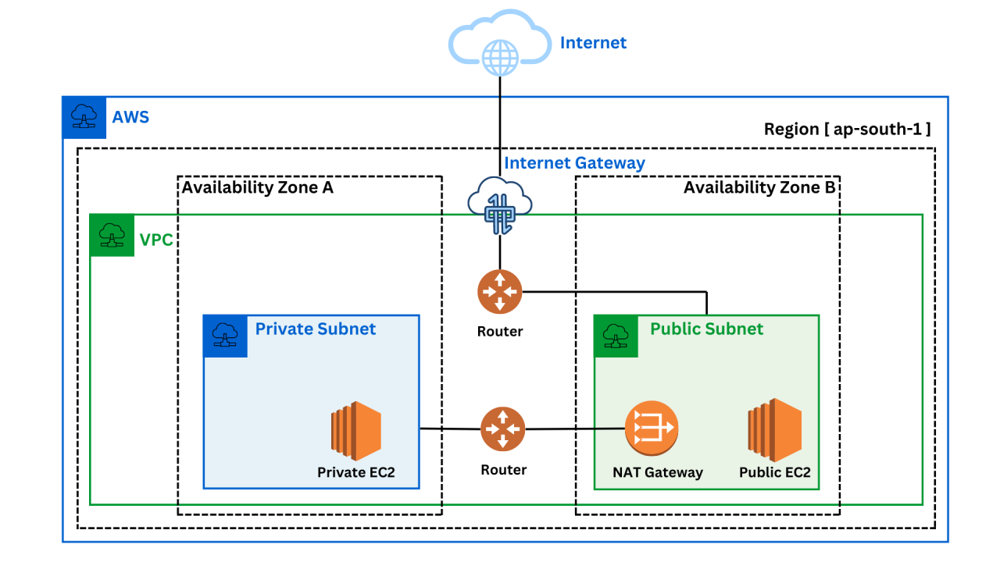

# AWS VPC Infrastructure

> Multi-AZ VPC with public/private subnets, Nginx on private EC2s behind an Application Load Balancer, and NAT Gateway for secure outbound access.

---

## Table of Contents

- [Architecture Overview](#architecture-overview)
- [VPC & Subnets](#vpc--subnets)
- [Networking](#networking)
  - [Internet Gateway](#internet-gateway)
  - [NAT Gateway](#nat-gateway)
  - [Route Tables](#route-tables)
- [Security Groups](#security-groups)
- [EC2 Instances](#ec2-instances)
- [Application Load Balancer](#application-load-balancer)
- [Traffic Flow](#traffic-flow)
- [Accessing the Application](#accessing-the-application)
- [SSH Access](#ssh-access)
- [Connectivity Tests](#connectivity-tests)

---

## Architecture Overview

```
                        
```

---

## VPC & Subnets

A **Virtual Private Cloud (VPC)** provides an isolated network boundary within AWS, giving full control over IP ranges, subnets, and traffic routing.

### VPC Configuration

| Resource | Value |
|---|---|
| CIDR Block | `172.16.0.0/16` |
| Region | `us-east-1` |

### Subnet Layout

| Subnet | CIDR | Availability Zone | Type |
|---|---|---|---|
| Public Subnet A | `172.16.1.0/24` | `us-east-1a` | Public |
| Public Subnet B | `172.16.3.0/24` | `us-east-1b` | Public |
| Private Subnet A | `172.16.2.0/24` | `us-east-1a` | Private |
| Private Subnet B | `172.16.4.0/24` | `us-east-1b` | Private |

**Public subnets** are routed through the Internet Gateway — resources here can receive public IPs and are used for the ALB and jump hosts.

**Private subnets** have no direct internet access and host the Nginx application servers, ensuring they are never directly exposed to the internet.

---

## Networking

### Internet Gateway

An **Internet Gateway (IGW)** bridges the VPC to the public internet. Public subnets use it for full two-way internet access.

| Resource | Config |
|---|---|
| Internet Gateway | `main-igw` → attached to VPC |

### NAT Gateway

A **NAT Gateway** allows private EC2s to initiate outbound internet connections (e.g., package updates) without exposing them to inbound traffic. It is placed in a public subnet since it requires internet access itself.

```
Private EC2 → NAT Gateway → Internet Gateway → Internet
```

| Resource | Config |
|---|---|
| NAT Gateway | `main-nat-gw` · Public Subnet A · Elastic IP |

### Route Tables

Route tables define how traffic is directed from each subnet.

| Route Table | Associated Subnets | Destination | Target | Purpose |
|---|---|---|---|---|
| `RT-public` | Public Subnet A, Public Subnet B | `0.0.0.0/0` | IGW | Full internet access for public resources |
| `RT-private` | Private Subnet A, Private Subnet B | `0.0.0.0/0` | NAT Gateway | Outbound-only internet for private resources |

---

## Security Groups

Security groups act as virtual firewalls, controlling inbound and outbound traffic at the instance level.

### `SG-public` — Applied to Public EC2s

| Direction | Protocol | Port | Source |
|---|---|---|---|
| Inbound | TCP | `22` | `<your-ip>/32` |
| Inbound | TCP | `80` | `0.0.0.0/0` |
| Outbound | All | All | `0.0.0.0/0` |

### `SG-private` — Applied to Private EC2s (Nginx servers)

| Direction | Protocol | Port | Source |
|---|---|---|---|
| Inbound | TCP | `22` | `SG-public` |
| Inbound | TCP | `80` | `0.0.0.0/0` |
| Outbound | All | All | `0.0.0.0/0` |

> **Note:** Private EC2s accept SSH only from `SG-public` (the jump hosts) and HTTP only from the ALB, ensuring no direct exposure to the internet.

---

## EC2 Instances

All instances run `t3.micro` with Amazon Linux 2023, one per subnet.

| Instance | Subnet | Role | IP Type |
|---|---|---|---|
| `public-ec2-1` | Public Subnet A | SSH jump host | Public + Private |
| `public-ec2-2` | Public Subnet B | SSH jump host | Public + Private |
| `private-ec2-1` | Private Subnet A | Nginx web server | Private only |
| `private-ec2-2` | Private Subnet B | Nginx web server | Private only |

### UserData Bootstrap Script

Private EC2s are automatically configured on first boot via the following UserData script — no manual SSH required:

```bash
#!/bin/bash
dnf update -y && dnf install -y nginx
systemctl start nginx && systemctl enable nginx
echo "<h1>Hello from $(hostname -f)</h1>" > /usr/share/nginx/html/index.html
```

---

## Application Load Balancer

The **ALB** is the sole public entry point for the application. It distributes HTTP traffic across private EC2s and provides automatic failover if an instance becomes unhealthy.

| Resource | Config |
|---|---|
| ALB | `main-alb` · Internet-facing · Public Subnet A & B |
| Listener | HTTP `80` → Forward to `private-tg` |
| Target Group | `private-tg` · HTTP `80` · Targets: `private-ec2-1`, `private-ec2-2` |
| Health Check | `GET /` · Interval: 30s · Healthy/Unhealthy threshold: 2/3 |

---

## Traffic Flow

```
[User]
  │
  ▼
[ALB :80]  (internet-facing, Public Subnet A & B)
  │
  ├──► [private-ec2-1]  Nginx, Private Subnet A
  └──► [private-ec2-2]  Nginx, Private Subnet B

[Private EC2] ──► [NAT GW] ──► [IGW] ──► Internet  (outbound only)

[SSH]  Your IP ──► public-ec2 ──► private-ec2
```

---

## Accessing the Application

Private EC2s have no public IP. All external traffic must go through the **ALB DNS name**.

```bash
# Via terminal
curl http://<alb-dns-name>

# Via browser
http://<alb-dns-name>
```

> **Tip:** Retrieve the ALB DNS name from: **AWS Console → EC2 → Load Balancers → DNS name**

---

## SSH Access

Private EC2s are not directly reachable from the internet. Use a **public EC2 as a jump host**.

### Step-by-Step

**Step 1 — Connect to the public EC2:**

```bash
ssh -i your-key.pem ec2-user@<public-ec2-ip>
```

**Step 2 — From the public EC2, connect to the private EC2:**

```bash
ssh -i ~/.ssh/your-key.pem ec2-user@<private-ec2-private-ip>
```

### Single-Command Jump (ProxyJump)

```bash
ssh -i your-key.pem -J ec2-user@<public-ec2-ip> ec2-user@<private-ec2-private-ip>
```

### Access Matrix

| Access Method | Without Jump Host | With Jump Host |
|---|---|---|
| SSH into private EC2 | ❌ Not possible | ✅ Via jump host |
| curl / ping private EC2 | ❌ No entry point | ✅ From public EC2 |
| App access via browser | ✅ Via ALB | ✅ Via ALB |

---

## Connectivity Tests

Once inside the public EC2, run the following to verify connectivity to private instances:

```bash
# Test Nginx is responding on private EC2s
curl http://172.16.2.x
curl http://172.16.4.x

# Verify port 80 is open
nc -zv 172.16.2.x 80

# SSH into a private EC2
ssh -i ~/.ssh/your-key.pem ec2-user@172.16.2.x
```

---

*Infrastructure deployed in `us-east-1` across two Availability Zones for high availability.*
